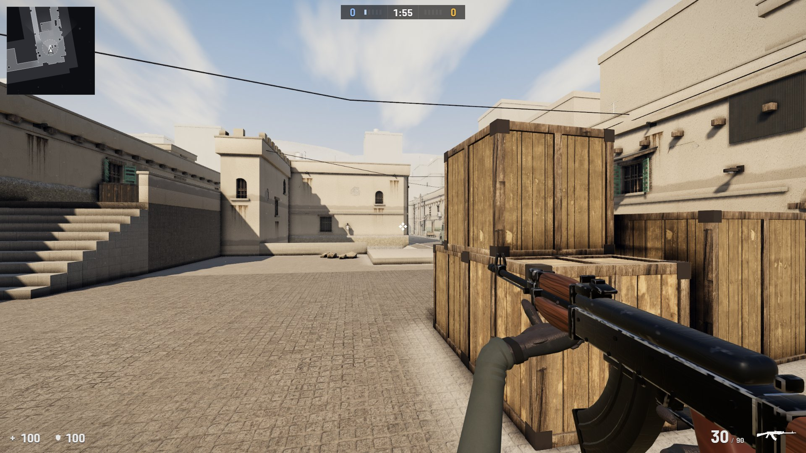
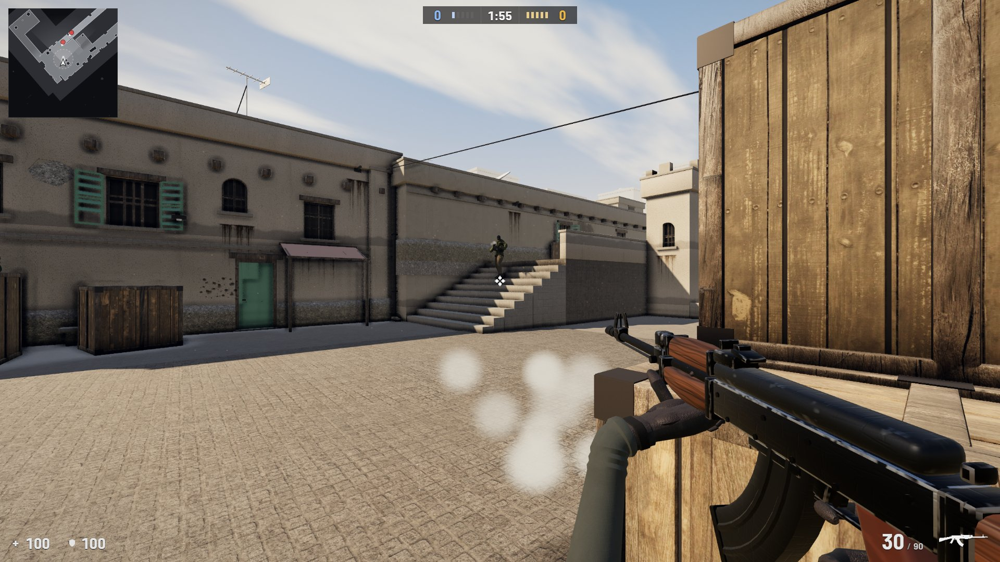
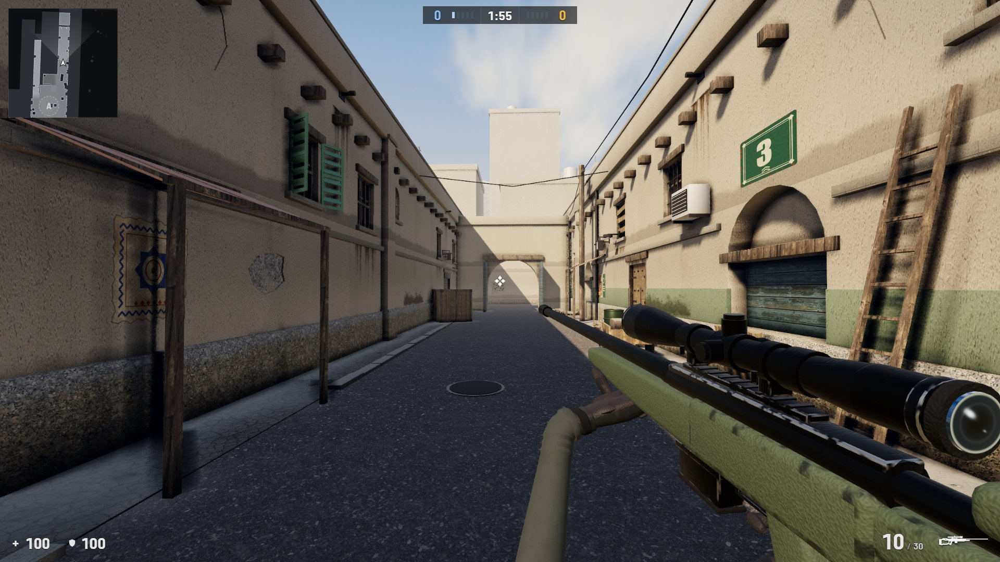
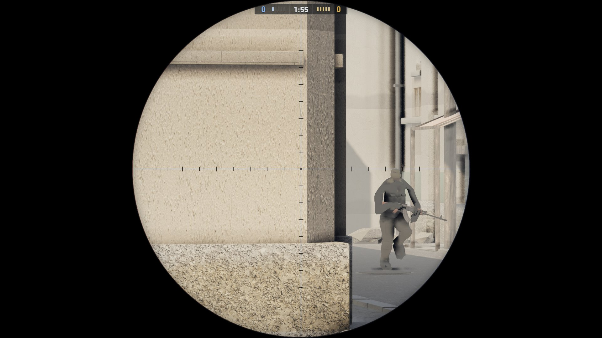

# Counter-Strike in the browser

A single-player, CS2-style round on a Dust II A-site, running in a browser tab.
Three.js r185 and three-mesh-bvh, no framework. The map, the weapons, the gloved
hands, the C4 and the bots' bodies were all built procedurally by Python scripts
running inside Blender (driven through the Blender MCP add-on, later in
background mode) and exported to GLB. You spawn CT, five T bots push long and
short, peek, take cover and plant; you hold the site with an AK-47, an AWP and a
knife, or defuse. Sides alternate every round. No Valve assets.



*Straight out of the running build, headless, at 1920 x 1080. Nothing in it is
composited and nothing is retouched.*

**[Play it here](https://starknightt.github.io/counter-strike-in-browser/)** —
desktop browser, keyboard and mouse. Click PLAY to lock the pointer. The site is
deployed from `main` by GitHub Actions.

**Read the full write-up: [PROJECT.md](PROJECT.md).** The pipeline, every
system, the testing, the tuning, and what was and was not used.

It wants a desktop GPU: HUD, radar, killfeed, a Valorant-code crosshair, a Web
Audio engine with occlusion, GTAO, bloom, sun shafts and custom stable PCF
shadows, at 60 fps on an RTX 4060 at 1080p. There is no touch scheme, so it will
not play on a phone.

## Running it locally

```bash
git clone https://github.com/StarKnightt/counter-strike-in-browser.git
cd counter-strike-in-browser
npm install
npm run dev            # vite on http://localhost:5188/, then click PLAY
```

`npm run build` makes the production bundle in `dist/`; `npm run build:pages`
is the same with the GitHub Pages base path, which is what
`.github/workflows/pages.yml` runs on every push to `main`.

Everything the game needs to run is in the repository
(`public/models/dust2_a.webp.glb` is the 34 MB runtime map). Three things are
not included, and all of them are regenerable:

- `assets_src/dust2_a.glb`, the 85 MB source export. Rebuild it with
  `tools/build_map.py` inside Blender, then
  `npx @gltf-transform/cli webp assets_src/dust2_a.glb public/models/dust2_a.webp.glb`.
- `tools/texcache/`, about 130 MB of Poly Haven textures the map script reads.
  `python tools/fetch_textures.py && python tools/grade_textures.py`.
- The review screenshots and recorded rounds in `shots/`, and the CS2 reference
  frames in `_ref/`.

No API keys are needed anywhere: `tools/fs.mjs` reads Freesound's public pages
and `tools/fetch_textures.py` uses the public Poly Haven API.



## Controls

| Input | Action |
| --- | --- |
| `W` `A` `S` `D` | Move |
| Mouse | Look |
| Left click | Fire, or knife slash |
| Right click | AK: aim down sights. AWP: scope, two zoom levels, then back out. Knife: heavy stab |
| `Space` | Jump |
| `Shift` / `C` | Crouch |
| `Ctrl` | Walk |
| `1` `2` `3` | AK-47 / AWP / knife |
| `Q` | Last weapon |
| Mouse wheel | Cycle weapons |
| `R` | Reload |
| `E` (hold) | Defuse as CT, or plant as T inside the A zone |
| `Esc` | Release the pointer and fullscreen; click to resume |

After the result card, a click starts the next round.



The AWP scopes in two steps on right click and back out on the third; a shot
unscopes for the bolt and re-scopes to the level you had.



## URL parameters

| Parameter | Does |
| --- | --- |
| `?explore=1` | Walk the map alone, god mode, no round end |
| `?bots=easy\|normal\|hard` | Bot difficulty |
| `?side=t\|ct` | Which side you start on |
| `?nolock=1` | No pointer or keyboard lock (automation) |
| `?sens=2.0` | Mouse sensitivity |
| `?xhair=<code>` | Crosshair from a Valorant crosshair code |
| `?scale=1\|1.25\|1.4` | HUD scale |
| `?view=x,y,z,yaw,pitch` | Fly camera at a fixed pose, for screenshots |
| `?pcf=stock` | three.js's stock PCF shadows instead of the custom filter |
| `?aa=msaa\|smaa\|none` | Anti-aliasing |
| `?ao=normal\|depth` | Ambient occlusion mode |

## Cheats

The page exposes `window.__game`; the cheats live on `window.__game.cheats` in
the console. Values marked persisted survive a reload.

| Call | Does |
| --- | --- |
| `noclip()` | Toggle flying through walls |
| `tp(x, y, z)` | Teleport, `y` optional |
| `bots(on)` | Spawn or remove the enemy team |
| `god = true\|false` | Invulnerability |
| `sens(v)` | Sensitivity, persisted |
| `xhair(code)` | Crosshair code, persisted |
| `difficulty('easy'\|'normal'\|'hard')` | Bot difficulty, persisted |
| `side('t'\|'ct')` | Side from the next round on, persisted |
| `bomb()` | Hand the player the C4 |
| `pos`, `yaw` | Getters for where you are and where you face |

`window.__view(x, y, z, yaw, pitch)` swaps to the fly camera, which is how the
screenshots above and the review tooling in `tools/` are captured.

## What is in it

- A Dust II A-site — long, doors, car, pit, short, the stairs, goose, ramp and
  CT spawn — built from a Blender Python script, textured with Poly Haven sets
  and exported as one WebP-compressed GLB.
- Three weapons with viewmodels, ADS, scope, recoil, reload, tracers and
  brass, all modelled and textured in the same Blender pipeline and held in
  gloved hands.
- Five T bots on a nav graph with cover points, peeks, callouts, a plant
  routine and three difficulty tiers; a round with a timer, a bomb, a defuse
  and alternating sides.
- HUD with radar, killfeed, damage wedges, a result card and a Valorant-code
  crosshair; a Web Audio engine with occlusion and TTS voice lines.
- GTAO, bloom, sun shafts and a custom stable PCF shadow filter, at 60 fps on an
  RTX 4060 at 1080p.

## Credits

Textures baked into the map: [Poly Haven](https://polyhaven.com/), CC0. Sounds:
Freesound contributors, CC0, with per-file attribution in
`public/audio/CREDITS.txt`. Bot skeleton and the Idle / Walk / Run clips: the
three.js example `Soldier.glb` (Mixamo rig); bot bodies generated with the MPFB2
(MakeHuman) Blender add-on. HUD font: Barlow Semi Condensed (OFL). Voice lines:
Windows TTS plus DSP. Everything else — geometry, weapon textures, grime,
decals, sky, effects — is generated by the scripts in `tools/` and `src/`.

No Valve assets. This is a fan project and is not affiliated with Valve.

## Stack

Three.js 0.185 · three-mesh-bvh · Vite · Blender (bpy, via the Blender MCP
add-on) · Web Audio · Playwright for the capture and test harnesses · GitHub
Pages.

## License

MIT for the code. Third-party assets stay under their own CC0 / OFL terms. See
[LICENSE](LICENSE).
